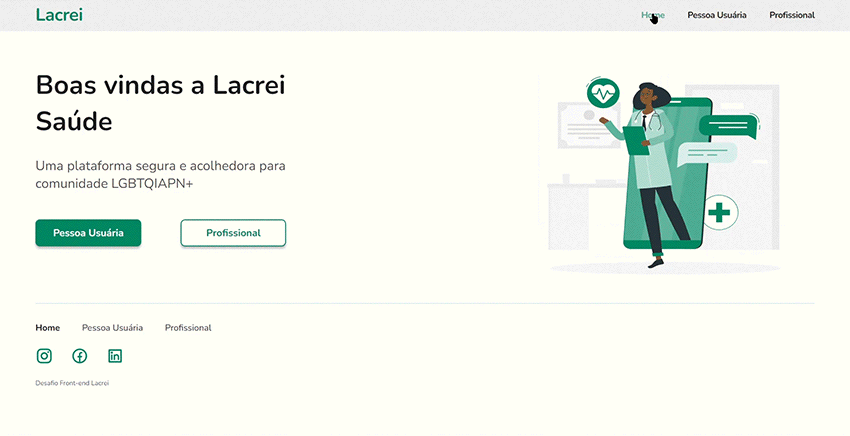

<!-- PROJECT LOGO -->
 

  

  <h3 align="center">Portal Lacrei | Desafio Front-End</h3>

  

    Simple one page application using ReactJS and Styled Components. Built for Lacrei, a Brazilian application that provides medical and legal assistance to the LGBTQIA+ community.
     
     
    <a href="https://desafio-front-end-lacrei-praxeds.vercel.app/">Live Website</a>
    ·
    <a href="https://www.portallacrei.com.br/">Portal Lacrei</a>
  

<!-- Built With -->
## 🛠️ Built With

    
    
    

<!-- Install -->
## 🚀 Install

`npm start` in the root folder to start the development server.

<!-- CONTACT -->
## 📩 Contact

Juliana Praxedes - contact@julianapraxedes.com

Project Link: [https://github.com/praxeds/desafio-front-end-lacrei](https://github.com/praxeds/desafio-front-end-lacrei)

(<a href="#top">back to top</a>)

